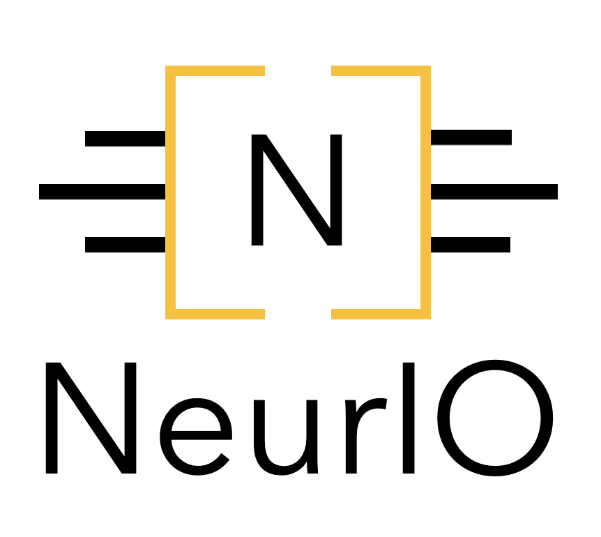

<div align="center">
  
</div>

# Welcome to NeurIO!
[NeurIO](https://www.neurio.org/) is an end-to-end open source platform
for benchmarking embedded machine learning. It a comprehensive and flexible tool for 
deploying neural networks on embedded devices, that lets
researchers push the state-of-the-art in low-power ML and developers easily build and
deploy ML-powered applications for IoT.

NeurIO was originally developed by researchers and engineers working in the
ANDANTE European Project, with the goal of democratizing AI accelerators for edge devices.

## Install

To use NeurIO, clone the current release:

```
$ git clone [this project]
```

Then, install the dependencies:

```
$ pip install -r requirements.txt
```

## Getting started

### Build the documentation

To build the documentation, you need to install the following dependencies:

```
$ pip install sphinx sphinx_book_theme
```

Then, you can build the documentation by running the following commands:

```
$ cd neurio/docs/
$ sh build_doc.sh
```

The documentation contains all the information for getting started using NeurIO.
You can then open the documentation by opening `docs/_build/html/index.html` in your browser.


## Contribution guidelines

**If you want to contribute to NeurIO, be sure to review the
[contribution guidelines](docs/contribution/CONTRIBUTING.md). This project adheres to NeurIO's
[code of conduct](docs/contribution/CODE_OF_CONDUCT.md). By participating, you are expected to
uphold this code.**

**We use [GitHub issues](https://github.com/csem/neurio/issues) for
tracking requests and bugs. The NeurIO project strives to abide by generally accepted best practices in
open-source software development.**

## Resources

*   [NeurIO.org](https://www.neurio.org)

## License

GNU General Public License (GPL), version 3 : [GPLv3](LICENSE)
