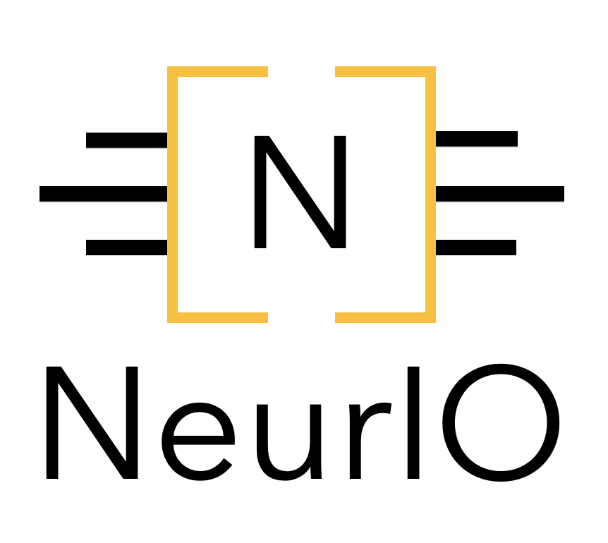

Welcome to NeurIO
==============================
NeurIO is a powerful library designed to simplify the deployment of machine learning models onto hardware devices. It is designed to be modular and extensible, allowing you to easily add support for new devices and tasks.

NeurIO aims to simplify the deployment of machine learning models onto hardware devices, by providing a unified interface for the deployment of machine learning models. This interface allows user to deploy their models on a wide range of devices, without having to learn the specifics of each device. NeurIO provides a direct interface to the devices without having to leave Python.

The underlying optimization and quantization algorithms are taken care of by NeurIO, allowing you to focus on the development of your machine learning models. All optimizations are performed automatically using the tools provided by the constructor of the hardware platforms, and the user can choose between different optimization strategies.

NeurIO also contains a set of tests and benchmarks for each device, allowing you to compare the performance of your models on different devices. The results are unified, allowing fair and easy comparison between runs and devices.

All the code is open-source and available on Github.

Ready to deploy your edge application? Let’s get started!

.. toctree::
   :maxdepth: 1
   :caption: The Basics

   basics/installation
   basics/getting_started
   basics/generic_deployment
   basics/results_handling

.. .. toctree::
   :maxdepth: 1
   :caption: Supported Platforms
   supported_devices/canaan
   supported_devices/stmicroelectronics
   supported_devices/synsense

.. toctree::
   :maxdepth: 1
   :caption: Advanced

   advanced/benchmarking/benchmarking
   advanced/api_reference/api_reference
   advanced/CHANGELOG

.. toctree::
   :maxdepth: 1
   :caption: Contribution

   contribution/CONTRIBUTING
   contribution/ADD_A_DEVICE
   contribution/CODE_OF_CONDUCT
   contribution/WALL_OF_FAME

.. toctree::
   :maxdepth: 1
   :caption: Troubleshooting

   troubleshooting/FAQ

* :ref:`genindex`

